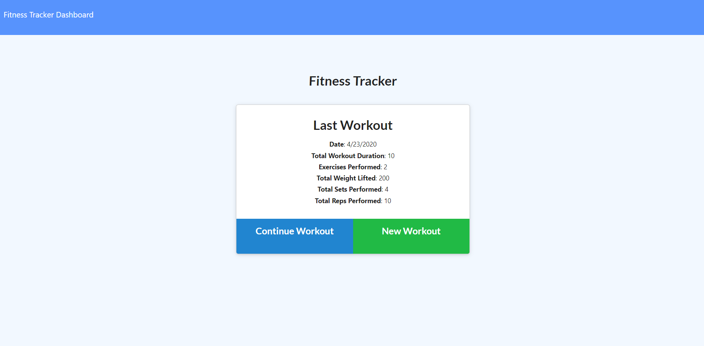
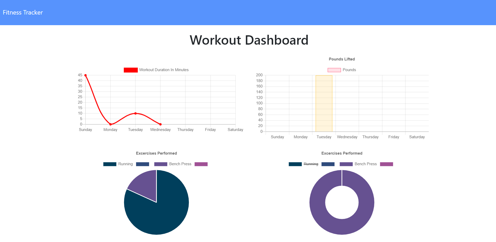
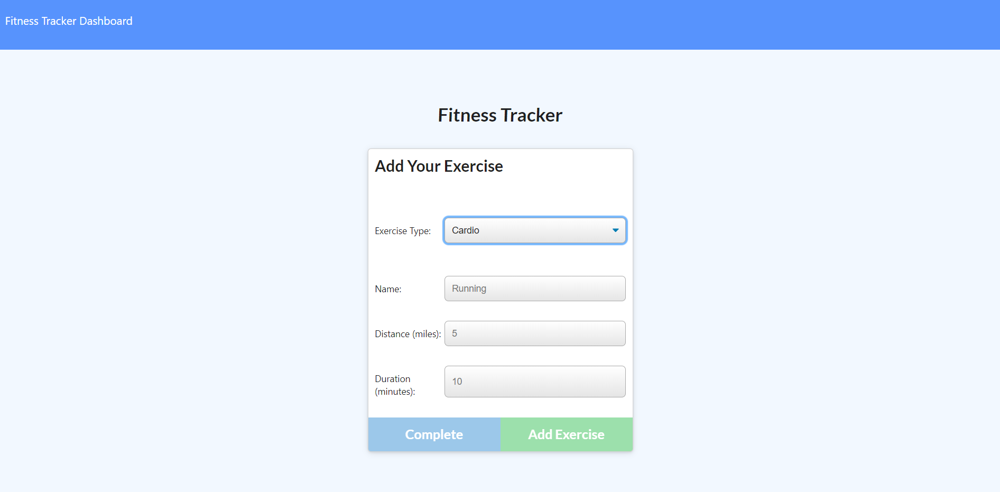

# Workout Tracker

## Description
Workout Tracker is a web app that allows you to track your workouts from day to day. Create a new workout with its own unique exercises or continue the most recent workout. You can also view the stats for the past week's workouts at the workout dashboard.

## Screenshots
Home page:

Your stats:

Add new exercise: 

## Link to Deployed Application
https://aqueous-river-68988.herokuapp.com/

## Technologies
Backed with a MongoDB database and Mongoose ORM.

